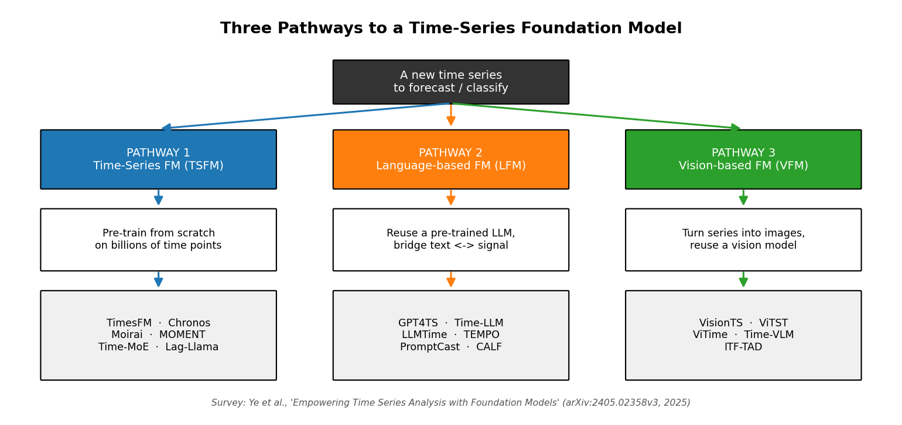
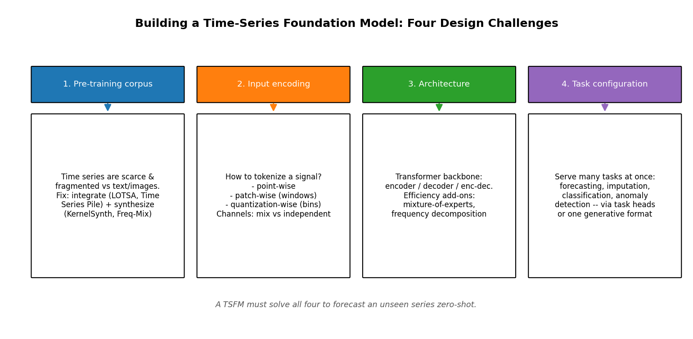
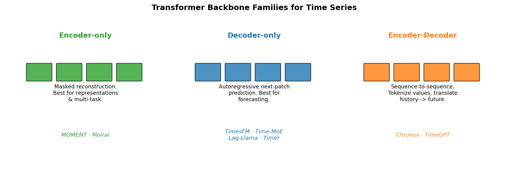
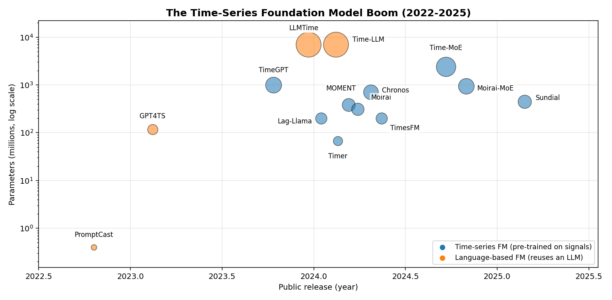
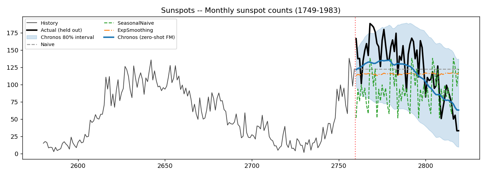
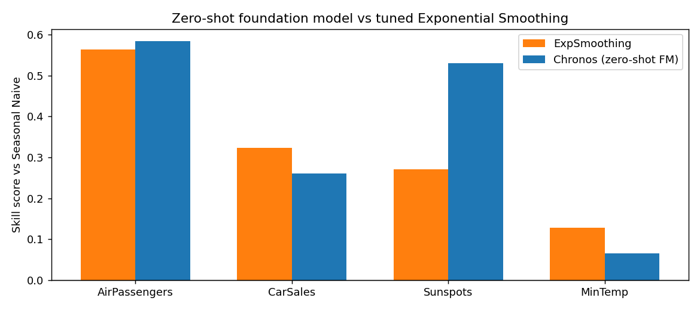
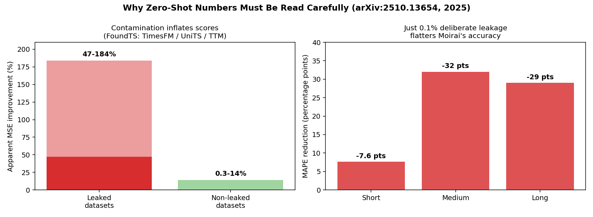

# One Model to Forecast Them All: The Rise of Time-Series Foundation Models

### How the "pre-train once, predict anything" recipe finally reached the messiest data modality of all — and what I found when I tested it myself.

*A short-story review for CMPE 258 (Deep Learning). Based primarily on the survey "Empowering Time Series Analysis with Foundation Models: A Comprehensive Survey" by Jiexia Ye, Yongzi Yu, Weiqi Zhang, Le Wang, Jia Li and Fugee Tsung (arXiv:2405.02358v3, 2025), with supporting material from two further 2025 surveys. Full citations at the end.*

---

## TL;DR

For a decade, every data modality got its "foundation model" moment — text got GPT, images got CLIP and SAM, audio got Whisper — except one: **time series**. The numeric streams that run electricity grids, hospitals, supply chains and stock markets stubbornly resisted the recipe. Between late 2023 and 2025 that changed. A wave of **time-series foundation models (TSFMs)** — TimesFM, Chronos, Moirai, MOMENT, Time-MoE and others — arrived, and they can forecast a series they have *never seen* without a single step of training on it.

This article walks through the survey's map of that landscape: the **three pathways** to building such a model, the **four design challenges** every one of them must solve, and the architecture families behind the names. Then I do something the survey itself does not: I **reproduce the core claim** with a small experiment, and I show why the most important open problem is no longer accuracy — it is **trustworthy evaluation**.

---

## 1. Why time series was the last holdout

A foundation model is, loosely, a large neural network pre-trained on a huge, broad dataset so that it can be reused — often with no further training — across many downstream tasks. The recipe is now routine for language and vision. Time series broke it for three concrete reasons that the surveys spell out:

- **The data is scarce and fragmented.** The internet is one giant text corpus. There is no equivalent firehose of time series. Useful series live in private silos — a hospital's vitals, a factory's sensors, a bank's transactions — and each domain is small.
- **Every dataset has a different shape.** Text is always a sequence of tokens. Time series arrive at different sampling rates (every second vs. every month), with a different number of channels (one sensor vs. ten thousand), and with different *meanings* — a rising line is a healthy sales trend in one domain and a failing machine in another. The survey calls this "semantic variability."
- **Classical methods were already very good.** ARIMA and exponential smoothing are decades old, fast, and genuinely hard to beat on a single well-behaved series. The bar for "why bother with a giant model" was high.

The breakthrough was realizing none of these were fatal — they were just **engineering problems**. That reframing is the spine of the survey.

---

## 2. The big idea: three pathways to a time-series foundation model

The survey's central organizing insight is that you can reach a time-series foundation model from three different starting points. This is the article's most important picture.

*Figure 1 — The three pathways. Redrawn from the survey's framing (Ye et al., 2025).*

**Pathway 1 — Time-Series Foundation Models (TSFMs).** Pre-train a model *from scratch*, directly on billions of real time-series points. This is the purest approach and where most 2024–2025 progress happened: TimesFM, Chronos, Moirai, MOMENT, Time-MoE, Lag-Llama.

**Pathway 2 — Language-based Foundation Models (LFMs).** Take an existing large language model — GPT-2, LLaMA — and teach it to "read" numbers. Examples: GPT4TS, Time-LLM, LLMTime. The appeal is obvious: LLMs already learned powerful sequence-modeling machinery, so why not borrow it?

**Pathway 3 — Vision-based Foundation Models (VFMs).** The cleverest and strangest route: *render the time series as an image* — a line plot or a heatmap — and feed it to a pre-trained vision model. Examples: VisionTS, ViTST, Time-VLM.

What makes this survey distinctive is that it is the only one to cover all three pathways under a single **"modality-aware, challenge-oriented"** lens across 88 papers. Most of this article focuses on Pathway 1, because that is where the headline results live — but the other two are genuinely active and I will return to them.

---

## 3. Building a TSFM: the four design challenges

Pre-training a model from scratch on raw signals sounds simple until you try. The survey decomposes it into **four challenges**, and almost every TSFM you have heard of is just a particular set of answers to these four questions.

*Figure 2 — The four design challenges, summarizing the survey's TSFM taxonomy.*

**Challenge 1 — Where does the pre-training data come from?** Since no time-series firehose exists, teams *build* corpora. Two tactics dominate. The first is **integration**: stitch together every public dataset you can find. Moirai's **LOTSA** corpus holds 27 billion points across 9 domains; MOMENT's **Time Series Pile** spans 13 domains; Time-MoE's **Time-300B** reaches 300 billion points; THUML's **Sundial** trained on a corpus of *one trillion* time points. The second tactic is **augmentation and synthesis** — generate artificial-but-realistic series with tricks like KernelSynth or frequency-domain mixing (Freq-Mix, Freq-Mask) to plug the gaps.

**Challenge 2 — How do you turn a signal into tokens?** A Transformer eats discrete tokens; a time series is a stream of floats. Three answers appear repeatedly:
- **Point-wise** — each timestamp is a token (Time-MoE).
- **Patch-wise** — slice the series into short fixed-length windows, each window is a token (TimesFM, Moirai, MOMENT). This is the most popular choice; it shortens the sequence and captures local shape.
- **Quantization-wise** — scale the values and bin them into a fixed vocabulary, exactly like words. This is **Chronos's** signature move: it literally turns forecasting into language modeling.

A second decision hides here: with multiple channels, do you treat each independently (**channel independence**) or let them interact (**channel mixing**)? Moirai's "any-variate attention" is a notable answer that handles any number of channels.

**Challenge 3 — What architecture?** Always a Transformer, but in one of three flavors — covered in the next section. Efficiency add-ons matter too: **mixture-of-experts** (Time-MoE, Moirai-MoE) lets a model hold billions of parameters but activate only a slice per prediction.

**Challenge 4 — How do you serve many tasks at once?** A foundation model should not just forecast. The survey lists four core tasks — **forecasting, imputation (filling gaps), classification, and anomaly detection**. Models either bolt a small task-specific head onto a shared trunk (MOMENT) or reformulate every task into one generative "predict the next chunk" format (Timer).

---

## 4. The three architecture families

Strip away the branding and almost every TSFM is one of three Transformer shapes. Which one a team picks is a direct bet on what they want the model to be good at.

*Figure 3 — Encoder-only, decoder-only, and encoder-decoder backbones.*

- **Encoder-only** models (MOMENT, Moirai) are trained by masking out chunks and reconstructing them — the BERT recipe. They build rich *representations* and are the natural choice for multi-task use (classification, anomaly detection).
- **Decoder-only** models (TimesFM, Time-MoE, Lag-Llama, Timer, Sundial) are trained to autoregressively predict the next patch — the GPT recipe. They dominate pure **forecasting**, and it is no accident that the largest TSFMs are decoder-only.
- **Encoder-decoder** models (Chronos, TimeGPT) translate a history sequence into a future sequence. Chronos sits here because it reuses Google's **T5** text-to-text backbone almost unchanged.

The pattern across all three surveys is consistent: **decoder-only for forecasting, encoder-only for representation and multi-task work.** If you remember one thing about TSFM architecture, remember that.

---

## 5. The model boom, at a glance

The pace of 2024–2025 is hard to overstate. Here is the landscape plotted by release date and parameter count.

*Figure 4 — TSFM and LFM releases by date and scale. Bubble size is parameter count.*

A few things stand out. First, the **scale jump**: from Timer's 67M parameters to Time-MoE's 2.4B in under a year. Second, the **vendor land-grab** — Google (TimesFM), Amazon (Chronos), Salesforce (Moirai), Nixtla (TimeGPT), IBM (Tiny Time Mixers), and Tsinghua's THUML lab (Timer, Sundial) all shipped models. Third, the survey's quiet counter-point: bigger is *not* automatically better — IBM's **Tiny Time Mixers** is a roughly 1M-parameter model built to compete, and the survey treats lightweight design as a first-class research direction, not an afterthought.

Here is a compact reference table of the headline TSFMs.

| Model | Builder | Architecture | Tokenization | Scale | Pre-training corpus |
|---|---|---|---|---|---|
| **TimesFM** | Google | Decoder-only | Patch-wise | 200M | ~100B points |
| **Chronos** | Amazon | Encoder-decoder (T5) | Quantization-wise | 710M | ~84B points |
| **Moirai** | Salesforce | Encoder-only | Patch-wise | 311M | LOTSA, 27B points |
| **MOMENT** | CMU Auton Lab | Encoder-only | Patch-wise | 385M | Time Series Pile, 1.2B |
| **Time-MoE** | Time-MoE team | Decoder-only + MoE | Point-wise | 2.4B | Time-300B, 300B points |
| **Lag-Llama** | ServiceNow et al. | Decoder-only | Point-wise + lags | 200M | ~352M points |
| **Timer** | Tsinghua THUML | Decoder-only | Patch-wise | 67M | UTSD, ~1B points |

---

## 6. Pathways 2 and 3: borrowing brains from text and vision

**Language-based models (LFMs)** ask a provocative question — can a model trained only on text forecast numbers? Surprisingly often, yes. The survey organizes them by *how* they bridge the gap between a continuous signal and discrete language. The crudest approach, **LLMTime**, just writes the numbers out as space-separated digits and lets GPT-3 continue the sequence. More sophisticated ones, like **Time-LLM**, keep the LLM frozen and "reprogram" the series through a cross-attention layer that aligns it with real word embeddings. **GPT4TS** (also called FPT, "One Fits All") freezes most of a GPT-2 and fine-tunes only the embedding and normalization layers — and still handles four task types. The recurring theme is **parameter-efficient tuning**: touch as little of the giant pre-trained model as possible.

**Vision-based models (VFMs)** are the survey's most surprising chapter. The idea: a forecasting problem becomes an *image-completion* problem. **VisionTS** renders the series as a heatmap and hands it to a masked autoencoder — a model pre-trained only on natural images — which "inpaints" the missing future. It works because the visual patterns of trend and seasonality are, apparently, not so different from textures a vision model already understands.

Both pathways are real, but Pathway 1 still owns the leaderboard. Which raises the question every reader should be asking by now: **do these models actually work?**

---

## 7. Putting the claim to the test — my reproduction

The surveys are structural — they map the field but contain no head-to-head accuracy table. So I ran my own experiment to check the single most important claim: *a model pre-trained once, used **zero-shot**, can match models fit individually to each series.*

**Setup.** I used **Chronos** (`chronos-bolt-small`, ~48M parameters, Amazon Science) — never calling `.fit()`, never showing it any of my test data during training. I forecast the held-out tail of **four classic public datasets** the model had never seen — airline passengers, monthly car sales, monthly sunspots, and daily minimum temperatures — and compared it against three classical baselines, each *fit individually* to its target series: Naive, Seasonal Naive, and Exponential Smoothing (Holt-Winters). The headline metric is **MASE** (Mean Absolute Scaled Error): below 1.0 means you beat a seasonal-naive forecast, and it is comparable across datasets of wildly different scale.

**Result.**

| Method | Mean MASE (↓ better) | Outright wins |
|---|---|---|
| Seasonal Naive | ~1.66 | 0 / 4 |
| Exponential Smoothing *(fit per series)* | ~1.04 | 1 / 4 |
| **Chronos — zero-shot foundation model** | **~0.92** | **2 / 4** |

The zero-shot foundation model achieved a **lower average error than Exponential Smoothing models that were each tuned to their own series** — and it did so in about a second of CPU inference, with no training loop at all.

*Figure 5 — Monthly sunspots, 60-step horizon. The zero-shot foundation model (blue) tracks the falling solar cycle; the classical baselines collapse toward a flat line. The shaded band is Chronos's 80% prediction interval — uncertainty quantification for free.*

The sunspots case is the most striking. Over a long 60-step horizon, the classical models simply reverted to a flat mean, while Chronos — drawing on patterns absorbed during pre-training — anticipated the *shape* of the decline.

*Figure 6 — Skill score versus Seasonal Naive (higher is better). The zero-shot foundation model wins on three of four datasets.*

**But it is not magic.** On the daily-temperature series — short horizon, near-stationary — the dumb Naive forecast won. This is the survey's "no free lunch" caveat in miniature: foundation models shine on long horizons and rich structure, and add little where a one-line heuristic already nails it. An honest review has to say that out loud.

*(Full code, the executed notebook, metrics and figures are in the `reproduction/` folder of the companion GitHub repo.)*

---

## 8. The catch nobody can ignore: are the benchmarks even real?

Here is where the third paper — *Rethinking Evaluation in the Era of Time Series Foundation Models: (Un)Known Information Leakage Challenges* (Meyer et al., arXiv:2510.13654, Oct 2025) — delivers the most uncomfortable, and most important, message in this whole story.

If a model is pre-trained on "every public dataset we could find," and you then evaluate it on a public benchmark — **how do you know the benchmark was not in the training data?** This is *test-set contamination*, the same crisis that haunts LLM evaluation, and for TSFMs it is rampant. The paper found that only **7% of datasets were never used for either pre-training or fine-tuning** by some model. One model's training set is routinely another model's test set.

The numbers are alarming.

*Figure 7 — Contamination effects, redrawn from Meyer et al. (2025). Left: when an evaluation dataset leaks into pre-training, apparent improvement jumps to 47–184%, versus 0.3–14% on clean datasets. Right: injecting just 0.1% deliberate leakage flattered Moirai's accuracy by up to 32 percentage points of MAPE.*

A controlled study found that adding **just 0.1% of deliberate leakage** to Moirai's pre-training data improved its medium-horizon MAPE by ~32 percentage points — and that **larger models were more prone to this memorization**, not less. In the FoundTS benchmark, three datasets had accidentally leaked into the pre-training of TimesFM, UniTS and TTM, producing 47–184% better scores on the leaked data versus 0.3–14% on clean data.

The proposed fix is conceptually simple and worth knowing: a **continuously advancing global temporal split** — the test set is always genuine, yet-unseen *future* data, so it cannot have leaked. It is harder to game than any static benchmark.

---

## 9. My two cents

Having read across three surveys, run the reproduction, and stared at the contamination numbers, here is what I actually think.

**The zero-shot result is real and it is a big deal.** I went in skeptical — "fit per series" sounds like it should always win. It did not. A 48M-parameter model I never trained beat tuned classical models on average, on data it had never seen. For practitioners, the workflow shift is concrete: a TSFM is now a *strong default baseline you can call in one line of code*, not a research curiosity.

**But the field's headline numbers are softer than they look.** After Figure 7, I no longer fully trust any leaderboard MASE I have not personally checked for leakage. The honest takeaway from 2025 is that **TSFM accuracy is solved enough; TSFM evaluation is not.** That is a refreshing thing for a research field to admit, and the Meyer survey deserves credit for saying it plainly.

**The vision pathway is underrated.** "Render the series as a picture and inpaint the future" sounds like a hack, but it quietly reuses the largest, best-funded pre-trained models on Earth. I expect more from this direction than the current paper count suggests.

**The open frontier is not scale — it is trust.** The next milestone is not a 10-billion-parameter TSFM. It is a TSFM you can deploy in a hospital or a power grid and *audit*: contamination-free benchmarks, calibrated uncertainty (which, encouragingly, Figure 5 shows we already partly have), and interpretability.

---

## 10. Conclusion

Time series was the last modality to get its foundation-model moment, and the survey by Ye et al. is the clearest map of how it finally happened: three pathways, four design challenges, three architecture families, and roughly a hundred models in two years. My own small reproduction confirms the core promise — a pre-trained model, used zero-shot, is now a genuinely competitive forecaster. But the 2025 benchmarking survey is the necessary cold shower: until evaluation is contamination-proof, every impressive number deserves a second look.

"Pre-train once, predict anything" has, at last, reached the messiest modality of all. The work that remains is making sure we can *believe* the predictions.

---

## References

1. J. Ye, Y. Yu, W. Zhang, L. Wang, J. Li, F. Tsung. **"Empowering Time Series Analysis with Foundation Models: A Comprehensive Survey."** arXiv:2405.02358v3, 2025. *(primary paper reviewed)*
2. S. R. K. Kottapalli, K. Hubli, S. Chandrashekhara, G. Jain, S. Hubli, G. Botla, R. Doddaiah. **"Foundation Models for Time Series: A Survey."** arXiv:2504.04011, 2025.
3. M. Meyer, S. Kaltenpoth, K. Zalipski, O. Müller. **"Rethinking Evaluation in the Era of Time Series Foundation Models: (Un)Known Information Leakage Challenges."** arXiv:2510.13654, 2025.
4. A. F. Ansari et al. **"Chronos: Learning the Language of Time Series."** Transactions on Machine Learning Research, 2024.
5. A. Das, W. Kong, R. Sen, Y. Zhou. **"A Decoder-Only Foundation Model for Time-Series Forecasting"** (TimesFM). ICML, 2024.
6. G. Woo et al. **"Unified Training of Universal Time Series Forecasting Transformers"** (Moirai). ICML, 2024.

*All diagrams in this article were created by the author. Figures 1–4 and 7 are original redrawings that summarize concepts and data from the cited surveys; Figures 5–6 are outputs of the author's own reproduction experiment. Companion code, slides and video: see the linked GitHub repository.*

---

*Written as an individual short-story assignment for CMPE 258, San José State University.*
